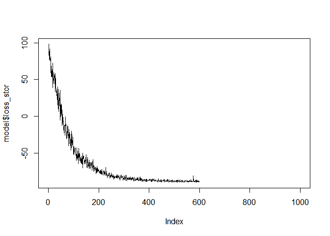
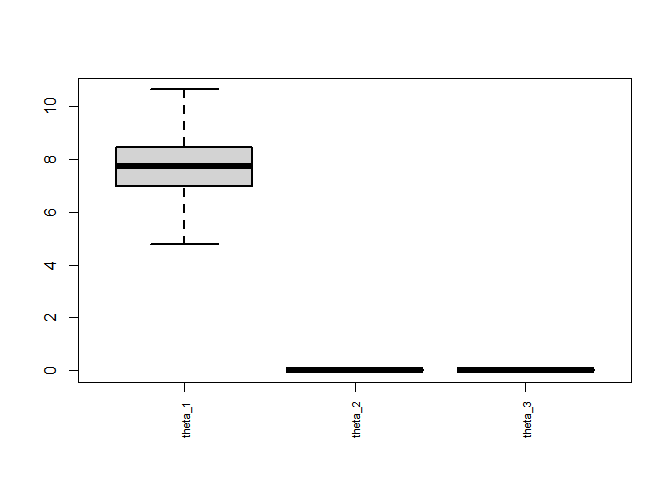
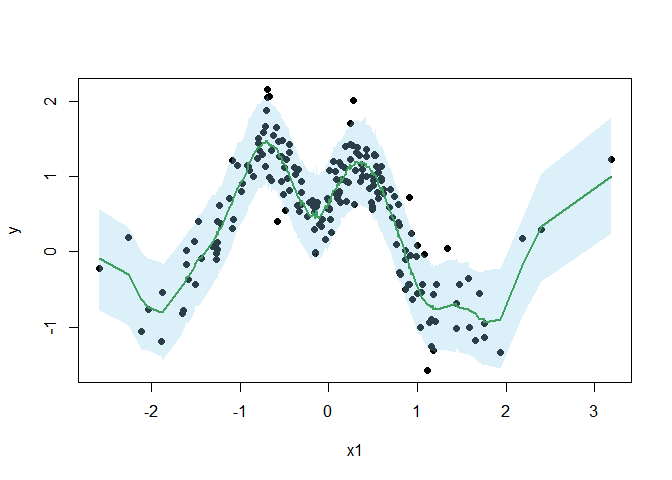

# shrinkGPR: Normalizing Flows for Hierarchical Shrinkage in Gaussian Process Regression Models

This repository contains the development version of `shrinkGPR` package
for Gaussian Process Regression with hierarchical shrinkage priors.
`shrinkGPR` uses the `torch` package to estimate the parameters via
variational inference and does not function without it. Specifically, it
is designed with GPU acceleration via CUDA in mind and may be slow
without it. Guidance on how to install `torch` with CUDA support can be
found
[here](https://cran.r-project.org/web/packages/torch/vignettes/installation.html).

The code below walks through a simple example, but is not exhaustive. It
simulates data, fits a shrinkage GPR model, checks model convergence,
extracts posterior samples, and makes predictions.

## Prerequisites

Ensure that you have installed the `shrinkGPR` package and Torch for R
before running the code. You can install the package using:

``` r
# Install necessary dependencies
remotes::install_github("NeferkareII/shrinkGPR")
library(shrinkGPR)
```

``` r
# Check if torch is installed, if this returns FALSE, the package will not work
torch::torch_is_installed()
```

    ## [1] TRUE

``` r
# Check if CUDA is available, if this returns FALSE, the package will work, albeit slower
torch::cuda_is_available()
```

    ## [1] TRUE

## Usage

### Simulate Data

The simGPR function is used to simulate data for Gaussian Process
Regression:

``` r
torch_manual_seed(123)
sim <- simGPR(N = 200, theta = c(10, 0, 0), d_mean = 0, sigma2 = 0.1)
```

Only one covariate (the first one) truly has an impact on y. The other
two covariates are noise.

### Model Fitting

Fit the shrinkage GPR model to the simulated data:

``` r
model <- shrinkGPR(y ~ ., data = sim$data, display_progress = FALSE)
```

`display_progress` is set to `FALSE` to avoid printing the progress bar.

### Check Convergence

Plot the model’s loss to monitor convergence:

``` r
plot(model$loss_stor, type = "l")
```

<!-- -->

### Generate posterior samples

Generate posterior samples from the variational approximation:

``` r
samples <- gen_posterior_samples(model, nsamp = 10000)
```

Plot parallel boxplots of the parameters without outliers:

``` r
boxplot(samples$thetas, lwd = 2, outline = FALSE, xaxt = "n")
axis(1, at = 1:ncol(samples$thetas), labels = paste0("theta_", 1:3), las = 2, cex.axis = 0.7)
```

<!-- -->

Note that the first parameter is the only one with a non-zero median.
The other two parameters are shrunk towards zero.

### Predictions

Make predictions using the model:

``` r
preds <- predict(model, newdata = sim$data, nsamp = 1000)
```

Plot the predicted values and 90% credible intervals:

``` r
preds_quantiles <- apply(preds, 2, quantile, c(0.05, 0.5, 0.95))
order <- order(sim$data$x.1)
plot(sim$data$x.1[order], sim$data$y[order], pch = 19, col = "black", xlab = "x1", ylab = "y")
lines(sim$data$x.1[order], preds_quantiles[2, order], col = "forestgreen", lwd = 2)
polygon(c(sim$data$x.1[order], rev(sim$data$x.1[order])),
        c(preds_quantiles[1, order], rev(preds_quantiles[3, order])),
        col = adjustcolor("skyblue", alpha.f = 0.3), border = NA)
```

<!-- -->
