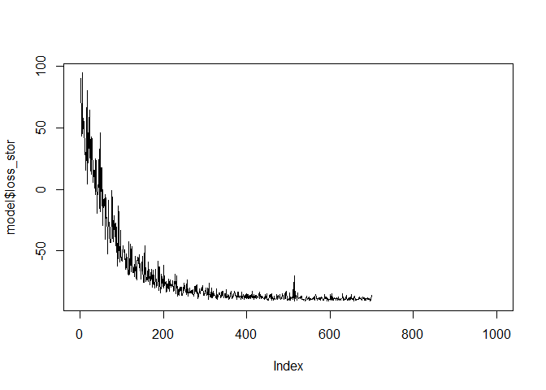
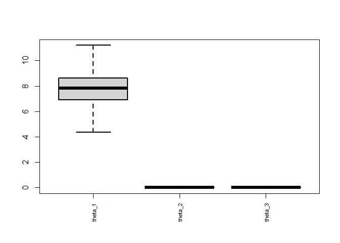
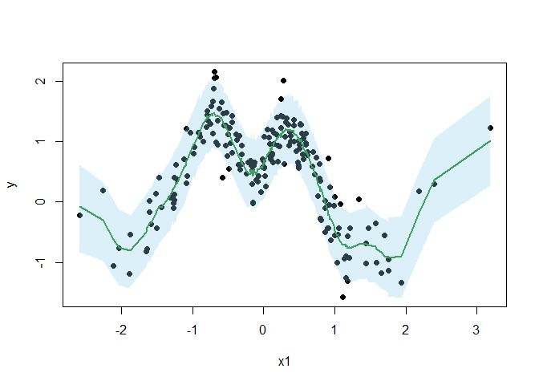

# shrinkGPR: Normalizing Flows for Hierarchical Shrinkage in Gaussian Process Regression Models

This repository contains a pre-release version of `shrinkGPR` package
for Gaussian Process Regression with hierarchical shrinkage priors. Note
that, as of version 0.1.0, no input checks are performed. `shrinkGPR`
uses the `torch` package to estimate the parameters via variational
inference. As such, it is designed with CUDA in mind and may be slow
without it. Guidance on how to install `torch` with CUDA support can be
found
[here](https://cran.r-project.org/web/packages/torch/vignettes/installation.html).

The code below walks through a simple example, but is not exhaustive. It
simulates data, fits a shrinkage GPR model, checks model convergence,
extracts posterior samples, and makes predictions.

## Prerequisites

Ensure that you have installed the `shrinkGPR` package and Torch for R
before running the code. You can install the package using:

``` r
# Install necessary dependencies
remotes::install_github("NeferkareII/shrinkGPR")
library(shrinkGPR)
```

## Usage

### Simulate Data

The simGPR function is used to simulate data for Gaussian Process
Regression:

``` r
torch_manual_seed(123)
sim <- simGPR(N = 200, theta = c(10, 0, 0), d_mean = 0, sigma2 = 0.1)
```

Only one covariate (the first one) truly has an impact on y. The other
two covariates are noise.

### Model Fitting

Fit the shrinkage GPR model to the simulated data:

``` r
model <- shrinkGPR(y ~ ., data = sim$data, display_progress = FALSE)
```

`display_progress` is set to `FALSE` to avoid printing the progress bar.

### Check Convergence

Plot the model’s loss to monitor convergence:

``` r
plot(model$loss_stor, type = "l")
```

<!-- -->

### Generate posterior samples

Generate posterior samples from the variational approximation:

``` r
samples <- gen_posterior_samples(model, nsamp = 10000)
```

Plot parallel boxplots of the parameters without outliers:

``` r
boxplot(samples$thetas, lwd = 2, outline = FALSE, xaxt = "n")
axis(1, at = 1:ncol(samples$thetas), labels = paste0("theta_", 1:3), las = 2, cex.axis = 0.7)
```

<!-- -->

Note that the first parameter is the only one with a non-zero median.
The other two parameters are shrunk towards zero.

### Predictions

Make predictions using the model:

``` r
preds <- predict(model, newdata = sim$data, nsamp = 1000)
```

Plot the predicted values and 90% credible intervals:

``` r
preds_quantiles <- apply(preds, 2, quantile, c(0.05, 0.5, 0.95))
order <- order(sim$data$x.1)
plot(sim$data$x.1[order], sim$data$y[order], pch = 19, col = "black", xlab = "x1", ylab = "y")
lines(sim$data$x.1[order], preds_quantiles[2, order], col = "forestgreen", lwd = 2)
polygon(c(sim$data$x.1[order], rev(sim$data$x.1[order])),
        c(preds_quantiles[1, order], rev(preds_quantiles[3, order])),
        col = adjustcolor("skyblue", alpha.f = 0.3), border = NA)
```

<!-- -->
